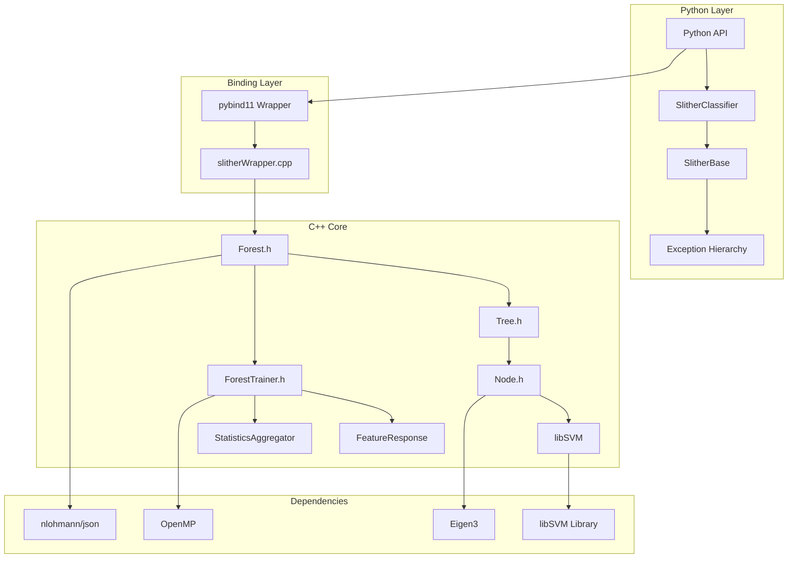
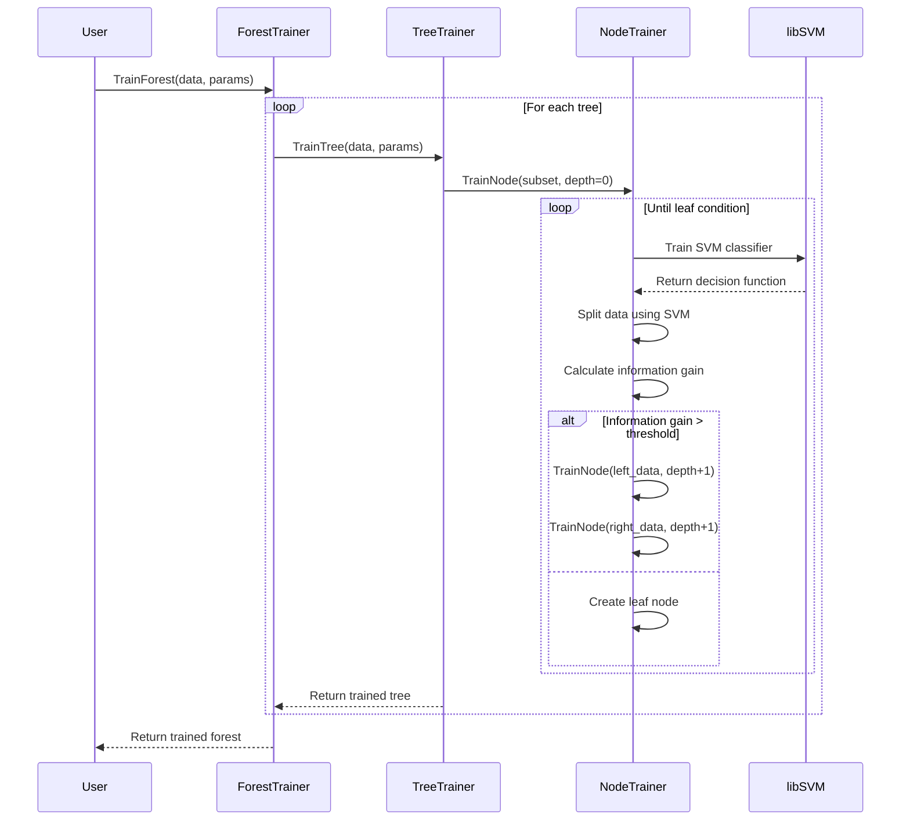

# Architecture Overview

This document provides a detailed overview of Slither's software architecture, design patterns, and implementation details.

## System Architecture

### High-Level Overview



### Component Layers

1. **Python API Layer**: User-facing scikit-learn compatible interface
2. **Binding Layer**: pybind11-based C++/Python bridge
3. **C++ Core**: High-performance Random Forest implementation
4. **External Dependencies**: Third-party libraries (libSVM, Eigen, etc.)

## Core Components

### Forest Structure

The Forest is the top-level container that manages multiple decision trees:

```cpp
template<class F, class S>
class Forest {
private:
    std::vector<std::unique_ptr<Tree<F, S>>> trees_;
    
public:
    // Tree management
    void AddTree(std::unique_ptr<Tree<F, S>> tree);
    size_t TreeCount() const { return trees_.size(); }
    
    // Prediction
    S Apply(const DataPoint& dataPoint) const;
    
    // Serialization
    void SerializeJson(const std::string& path) const;
    void DeserializeJson(const std::string& path);
};
```

#### Template Parameters

- **F**: Feature response function type (e.g., `LinearFeatureResponse`)
- **S**: Statistics aggregator type (e.g., `HistogramAggregator`)

### Tree Structure

Each Tree contains a binary tree of Nodes:

```cpp
template<class F, class S>
class Tree {
private:
    std::unique_ptr<Node<F, S>> root_;
    
public:
    Tree(std::unique_ptr<Node<F, S>> root);
    
    // Prediction
    S Apply(const DataPoint& dataPoint) const;
    
    // Tree traversal
    const Node<F, S>* GetRoot() const { return root_.get(); }
    
    // Serialization
    nlohmann::json SerializeJson() const;
    void DeserializeJson(const nlohmann::json& json);
};
```

### Node Structure

Nodes contain either SVM classifiers (internal nodes) or class statistics (leaf nodes):

```cpp
template<class F, class S>
class Node {
private:
    bool isLeaf_;
    
    // Internal node data
    F featureResponse_;  // SVM classifier
    std::unique_ptr<Node<F, S>> leftChild_;
    std::unique_ptr<Node<F, S>> rightChild_;
    
    // Leaf node data
    S trainingDataStatistics_;
    
public:
    // Node type queries
    bool IsLeaf() const { return isLeaf_; }
    
    // Tree traversal
    const Node<F, S>* GetLeftChild() const;
    const Node<F, S>* GetRightChild() const;
    
    // Prediction
    S Apply(const DataPoint& dataPoint) const;
    
    // Training data statistics (leaf nodes)
    const S& GetTrainingDataStatistics() const;
};
```

## Training Architecture

### Training Flow



### ForestTrainer

The ForestTrainer coordinates the training of multiple trees:

```cpp
template<class F, class S>
class ForestTrainer {
public:
    static std::unique_ptr<Forest<F, S>> TrainForest(
        const DataPointCollection& trainingData,
        const TrainingParameters& trainingParameters,
        ITrainingContext<F, S>& trainingContext
    );

private:
    static std::unique_ptr<Tree<F, S>> TrainTree(
        const DataPointCollection& trainingData,
        const TrainingParameters& trainingParameters,
        ITrainingContext<F, S>& trainingContext,
        int treeIndex
    );
};
```

### Training Parameters

Configuration is managed through the TrainingParameters class:

```cpp
class TrainingParameters {
public:
    // Forest parameters
    int NumberOfTrees = 10;
    int MaxDecisionLevels = 5;
    
    // Feature selection
    int NumberOfCandidateFeatures = 10;
    int NumberOfCandidateThresholds = 10;
    
    // SVM parameters
    double SvmC = 1.0;
    double SvmGamma = 1.0;
    
    // Stopping criteria
    double MinInformationGain = 0.0;
    int MinSamplesPerNode = 2;
    
    // Misc
    bool Verbose = false;
    int RandomSeed = 0;
};
```

## Feature Response Functions

### Interface Design

Feature response functions are pluggable components that define how splits are made:

```cpp
class IFeatureResponse {
public:
    // Training: Select features and train classifier
    virtual void Train(
        const DataPointCollection& data,
        const std::vector<int>& indices,
        const TrainingParameters& parameters
    ) = 0;
    
    // Prediction: Apply classifier to data point
    virtual double GetResponse(const DataPoint& dataPoint) const = 0;
    
    // Serialization
    virtual void Serialize(std::ostream& stream) const = 0;
    virtual void Deserialize(std::istream& stream) = 0;
};
```

### LinearFeatureResponse

The default implementation uses linear SVM classifiers:

```cpp
class LinearFeatureResponse : public IFeatureResponse {
private:
    std::vector<int> selectedFeatures_;
    std::vector<double> svmWeights_;
    double svmBias_;
    
public:
    void Train(
        const DataPointCollection& data,
        const std::vector<int>& indices,
        const TrainingParameters& parameters
    ) override;
    
    double GetResponse(const DataPoint& dataPoint) const override {
        double response = svmBias_;
        for (size_t i = 0; i < selectedFeatures_.size(); i++) {
            response += svmWeights_[i] * dataPoint[selectedFeatures_[i]];
        }
        return response;
    }
};
```

### SVM Training Process

```cpp
void LinearFeatureResponse::Train(
    const DataPointCollection& data,
    const std::vector<int>& indices,
    const TrainingParameters& parameters
) {
    // 1. Select random subset of features
    selectedFeatures_ = selectRandomFeatures(
        data.Dimensions(), 
        parameters.NumberOfCandidateFeatures
    );
    
    // 2. Extract training data for selected features
    cv::Mat X, y;
    extractTrainingData(data, indices, selectedFeatures_, X, y);
    
    // 3. Convert multi-class to binary problem
    cv::Mat binaryLabels = convertToBinary(y);
    
    // 4. Train SVM using libSVM
    svm_model* model = trainSVM(X, binaryLabels, parameters.SvmC);
    
    // 5. Extract weights and bias
    extractSVMParameters(model, svmWeights_, svmBias_);
    
    // 6. Clean up
    svm_free_and_destroy_model(&model);
}
```

## Statistics Aggregators

### Interface Design

Statistics aggregators collect and manage class distributions at nodes:

```cpp
template<typename DataPointType>
class IStatisticsAggregator {
public:
    // Add sample to statistics
    virtual void Aggregate(const DataPointType& dataPoint, int label) = 0;
    
    // Combine with another aggregator
    virtual IStatisticsAggregator& operator+=(
        const IStatisticsAggregator& other
    ) = 0;
    
    // Get prediction
    virtual int GetMaxBin() const = 0;
    virtual std::vector<double> GetProbabilities() const = 0;
    
    // Entropy calculation
    virtual double CalculateEntropy() const = 0;
};
```

### HistogramAggregator

The classification implementation maintains class histograms:

```cpp
class HistogramAggregator : public IStatisticsAggregator<DataPoint> {
private:
    std::vector<int> bins_;
    int totalCount_;
    
public:
    HistogramAggregator(int binCount) 
        : bins_(binCount, 0), totalCount_(0) {}
    
    void Aggregate(const DataPoint& dataPoint, int label) override {
        bins_[label]++;
        totalCount_++;
    }
    
    HistogramAggregator& operator+=(const HistogramAggregator& other) override {
        for (size_t i = 0; i < bins_.size(); i++) {
            bins_[i] += other.bins_[i];
        }
        totalCount_ += other.totalCount_;
        return *this;
    }
    
    double CalculateEntropy() const override {
        double entropy = 0.0;
        for (int count : bins_) {
            if (count > 0) {
                double p = static_cast<double>(count) / totalCount_;
                entropy -= p * std::log2(p);
            }
        }
        return entropy;
    }
};
```

## Data Management

### DataPointCollection

The main data container abstracts OpenCV Mat operations:

```cpp
class DataPointCollection {
private:
    cv::Mat data_;          // Feature matrix (n_samples x n_features)
    cv::Mat labels_;        // Label vector (n_samples x 1)
    int numClasses_;        // Number of unique classes
    
public:
    // Data loading
    void LoadData(const cv::Mat& features, const cv::Mat& labels);
    void LoadFromFile(const std::string& filepath);
    
    // Data access
    DataPoint GetDataPoint(int index) const;
    int GetIntegerLabel(int index) const;
    
    // Data properties
    int Count() const { return data_.rows; }
    int Dimensions() const { return data_.cols; }
    int CountClasses() const { return numClasses_; }
    
    // Data subsets
    std::vector<int> GetIndicesWithLabel(int label) const;
    DataPointCollection ExtractSubset(const std::vector<int>& indices) const;
};
```

### DataPoint

Lightweight wrapper around feature vectors:

```cpp
class DataPoint {
private:
    const float* features_;
    int dimensions_;
    
public:
    DataPoint(const float* features, int dimensions)
        : features_(features), dimensions_(dimensions) {}
    
    float operator[](int index) const {
        return features_[index];
    }
    
    int Count() const { return dimensions_; }
    
    // Iterator support
    const float* begin() const { return features_; }
    const float* end() const { return features_ + dimensions_; }
};
```

## Serialization Architecture

### JSON Format

Models are serialized in human-readable JSON format:

```json
{
  "format_version": "1.0",
  "tree_count": 10,
  "trees": [
    {
      "root": {
        "node_type": "split",
        "feature_response": {
          "type": "LinearFeatureResponse",
          "selected_features": [0, 3, 7, 12],
          "svm_weights": [0.5, -0.3, 0.8, -0.1],
          "svm_bias": 0.15
        },
        "left_child": {
          "node_type": "leaf",
          "statistics": {
            "type": "HistogramAggregator",
            "bins": [15, 5, 2],
            "total_count": 22
          }
        },
        "right_child": { "..." }
      }
    }
  ]
}
```

### Serialization Implementation

```cpp
template<class F, class S>
nlohmann::json Forest<F, S>::SerializeJson() const {
    nlohmann::json j;
    j["format_version"] = "1.0";
    j["tree_count"] = TreeCount();
    
    j["trees"] = nlohmann::json::array();
    for (const auto& tree : trees_) {
        j["trees"].push_back(tree->SerializeJson());
    }
    
    return j;
}

template<class F, class S>
void Forest<F, S>::DeserializeJson(const std::string& path) {
    std::ifstream file(path);
    nlohmann::json j;
    file >> j;
    
    // Validate format version
    if (j["format_version"] != "1.0") {
        throw std::runtime_error("Unsupported format version");
    }
    
    // Clear existing trees
    trees_.clear();
    
    // Load trees
    for (const auto& treeJson : j["trees"]) {
        auto tree = std::make_unique<Tree<F, S>>();
        tree->DeserializeJson(treeJson);
        trees_.push_back(std::move(tree));
    }
}
```

## Python Bindings Architecture

### pybind11 Integration

The Python bindings expose the C++ API through pybind11:

```cpp
// pyWrapper/wrapper.cpp
#include <pybind11/pybind11.h>
#include <pybind11/numpy.h>
#include <pybind11/stl.h>

class slitherWrapper {
private:
    std::unique_ptr<Forest<LinearFeatureResponse, HistogramAggregator>> forest_;
    TrainingParameters params_;
    
public:
    void setTrainingParameters(
        int trees, int depth, int candidateFeatures, 
        double svmC, bool verbose
    ) {
        params_.NumberOfTrees = trees;
        params_.MaxDecisionLevels = depth;
        params_.NumberOfCandidateFeatures = candidateFeatures;
        params_.SvmC = svmC;
        params_.Verbose = verbose;
    }
    
    void onlyTrain(py::array_t<float> X, py::array_t<int> y) {
        // Convert numpy arrays to OpenCV Mat
        cv::Mat features = numpyToCvMat(X);
        cv::Mat labels = numpyToCvMat(y);
        
        // Load data
        DataPointCollection data;
        data.LoadData(features, labels);
        
        // Train forest
        ClassificationTrainingContext<LinearFeatureResponse> context(
            data.CountClasses()
        );
        
        forest_ = ForestTrainer<LinearFeatureResponse, HistogramAggregator>
            ::TrainForest(data, params_, context);
    }
    
    py::array_t<double> onlyTest(py::array_t<float> X) {
        // Convert input
        cv::Mat features = numpyToCvMat(X);
        
        // Make predictions
        std::vector<std::vector<double>> predictions;
        for (int i = 0; i < features.rows; i++) {
            DataPoint dataPoint(features.ptr<float>(i), features.cols);
            auto result = forest_->Apply(dataPoint);
            predictions.push_back(result.GetProbabilities());
        }
        
        // Convert to numpy array
        return cvMatToNumpy(predictions);
    }
};

PYBIND11_MODULE(slitherWrapper, m) {
    py::class_<slitherWrapper>(m, "slitherWrapper")
        .def(py::init<>())
        .def("setTrainingParameters", &slitherWrapper::setTrainingParameters)
        .def("onlyTrain", &slitherWrapper::onlyTrain)
        .def("onlyTest", &slitherWrapper::onlyTest);
}
```

### Python API Layer

The scikit-learn compatible API wraps the pybind11 bindings:

```python
# python/slither/classifier.py
class SlitherClassifier(SlitherBase, ClassifierMixin):
    def __init__(self, n_estimators=10, max_depth=5, svm_c=1.0, verbose=False):
        self.n_estimators = n_estimators
        self.max_depth = max_depth
        self.svm_c = svm_c
        self.verbose = verbose
        self._fitted = False
        self._wrapper = None
    
    def fit(self, X, y):
        """Fit the classifier."""
        X, y = self._validate_input(X, y)
        
        # Create C++ wrapper
        from slitherWrapper import slitherWrapper
        self._wrapper = slitherWrapper()
        
        # Configure parameters
        self._wrapper.setTrainingParameters(
            self.n_estimators,
            self.max_depth, 
            self.n_candidate_features,
            self.svm_c,
            self.verbose
        )
        
        # Train model
        self._wrapper.onlyTrain(X.astype(np.float32), y.astype(np.int32))
        
        # Store metadata
        self.classes_ = np.unique(y)
        self.n_classes_ = len(self.classes_)
        self.n_features_in_ = X.shape[1]
        self._fitted = True
        
        return self
    
    def predict_proba(self, X):
        """Predict class probabilities."""
        if not self._fitted:
            raise SlitherNotFittedError("Model must be fitted before prediction")
        
        X = self._validate_input(X, fitted=True)
        
        # Get probabilities from C++ layer
        probabilities = self._wrapper.onlyTest(X.astype(np.float32))
        
        return probabilities
```

## Memory Management

### RAII Pattern

Slither uses RAII (Resource Acquisition Is Initialization) throughout:

```cpp
// Good: RAII with smart pointers
class Forest {
private:
    std::vector<std::unique_ptr<Tree>> trees_;  // Automatic cleanup
    
public:
    void addTree(std::unique_ptr<Tree> tree) {
        trees_.push_back(std::move(tree));  // Transfer ownership
    }
    
    // Destructor automatically cleans up all trees
    ~Forest() = default;
};

// Avoid: Manual memory management
class BadForest {
private:
    std::vector<Tree*> trees_;
    
public:
    void addTree(Tree* tree) {
        trees_.push_back(tree);  // Raw pointer - error prone
    }
    
    ~BadForest() {
        for (Tree* tree : trees_) {
            delete tree;  // Manual cleanup - can leak
        }
    }
};
```

### Exception Safety

All resource acquisition is exception-safe:

```cpp
std::unique_ptr<Forest> ForestTrainer::TrainForest(
    const DataPointCollection& data,
    const TrainingParameters& params,
    ITrainingContext& context
) {
    auto forest = std::make_unique<Forest>();
    
    for (int i = 0; i < params.NumberOfTrees; i++) {
        // If training fails, forest destructor cleans up
        // already-added trees automatically
        auto tree = TrainTree(data, params, context, i);
        forest->AddTree(std::move(tree));
    }
    
    return forest;  // Move semantics - no copying
}
```

## Performance Considerations

### Template Design

Templates enable compile-time optimization:

```cpp
// Template specialization for different feature types
template<>
class Forest<LinearFeatureResponse, HistogramAggregator> {
    // Specialized implementation for common case
    // Can inline SVM evaluation for better performance
};

// Generic template for extensibility
template<class F, class S>
class Forest {
    // General implementation
};
```

### Memory Layout

Data structures are designed for cache efficiency:

```cpp
class Node {
private:
    // Hot path data first (better cache locality)
    bool isLeaf_;                    // 1 byte
    F featureResponse_;              // SVM weights/bias
    
    // Cold path data last
    std::unique_ptr<Node> leftChild_;   // Rarely accessed during prediction
    std::unique_ptr<Node> rightChild_;
    S trainingDataStatistics_;       // Only used in leaf nodes
};
```

### Parallel Processing

OpenMP enables parallel tree training:

```cpp
#ifdef WITH_OPENMP
#pragma omp parallel for
#endif
for (int i = 0; i < params.NumberOfTrees; i++) {
    auto tree = TrainTree(data, params, context, i);
    
    // Thread-safe insertion
    #pragma omp critical
    {
        forest->AddTree(std::move(tree));
    }
}
```

## Extensibility Points

### Custom Feature Response

Users can implement custom splitting criteria:

```cpp
class RBFFeatureResponse : public IFeatureResponse {
private:
    std::vector<int> selectedFeatures_;
    std::vector<DataPoint> supportVectors_;
    std::vector<double> alphas_;
    double gamma_;
    
public:
    double GetResponse(const DataPoint& dataPoint) const override {
        double kernelSum = 0.0;
        for (size_t i = 0; i < supportVectors_.size(); i++) {
            double kernelValue = rbfKernel(dataPoint, supportVectors_[i], gamma_);
            kernelSum += alphas_[i] * kernelValue;
        }
        return kernelSum;
    }
    
private:
    double rbfKernel(const DataPoint& x1, const DataPoint& x2, double gamma) const {
        double distanceSquared = 0.0;
        for (int i = 0; i < x1.Count(); i++) {
            double diff = x1[i] - x2[i];
            distanceSquared += diff * diff;
        }
        return std::exp(-gamma * distanceSquared);
    }
};
```

### Custom Statistics

Domain-specific statistics can be implemented:

```cpp
class RegressionAggregator : public IStatisticsAggregator<DataPoint> {
private:
    double sumY_;
    double sumY2_;
    int count_;
    
public:
    void Aggregate(const DataPoint& dataPoint, double target) override {
        sumY_ += target;
        sumY2_ += target * target;
        count_++;
    }
    
    double GetMean() const { return sumY_ / count_; }
    double GetVariance() const {
        return (sumY2_ - sumY_ * sumY_ / count_) / (count_ - 1);
    }
};
```

This architecture provides a solid foundation for the Random Forest with SVM local experts while maintaining extensibility for future enhancements.