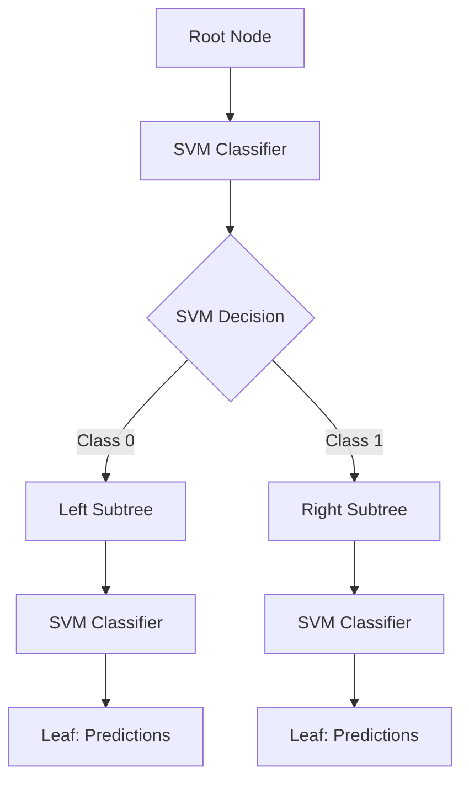
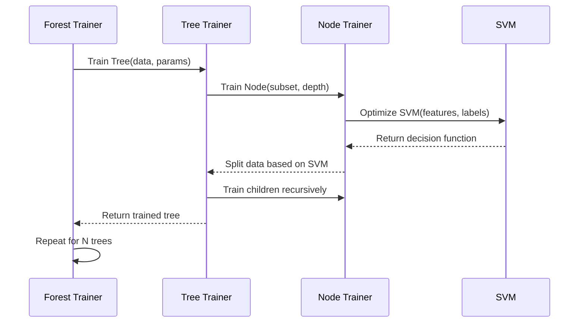

# Overview

Slither is a unique Random Forest implementation that combines ensemble learning with Support Vector Machine (SVM) local experts at tree nodes. This design makes it particularly effective for computer vision and high-dimensional classification tasks.

## What Makes Slither Different?

### Traditional Random Forest

```mermaid
graph TD
    A[Root Node] --> B{feature[i] < 0.5?}
    B -->|Yes| C[Left Subtree]
    B -->|No| D[Right Subtree]
    C --> E[Leaf: Class 0]
    D --> F[Leaf: Class 1]
```

**Decision Rule**: Simple threshold comparison  
**Complexity**: Linear decision boundaries  
**Training**: Fast threshold optimization  

### Slither Random Forest



**Decision Rule**: SVM classification at each node  
**Complexity**: Non-linear decision boundaries  
**Training**: SVM optimization at each split  

## Architecture Overview

### Forest Structure

```python
Forest
├── Tree 1
│   ├── Node 0 (Root): SVM Classifier
│   ├── Node 1: SVM Classifier  
│   ├── Node 2: SVM Classifier
│   └── ...
├── Tree 2
│   ├── Node 0 (Root): SVM Classifier
│   └── ...
└── Tree N
    └── ...
```

### Node Components

Each tree node contains:

1. **SVM Classifier**: Linear or non-linear decision function
2. **Training Statistics**: Class distributions and sample counts
3. **Split Criterion**: Information gain based splitting
4. **Child Pointers**: References to left and right subtrees

### Training Process



## Key Features

### 🌳 **Random Forest Ensemble**

- **Multiple Trees**: Train N independent decision trees
- **Bagging**: Each tree sees different data samples (future enhancement)
- **Feature Randomization**: Random feature subsets at each split
- **Majority Voting**: Ensemble predictions from all trees

### 🔬 **SVM Local Experts**

- **Complex Boundaries**: Non-linear decision functions at nodes
- **Feature Combinations**: Linear combinations of input features
- **Regularization**: SVM C parameter controls overfitting
- **Kernel Support**: Currently linear kernels (RBF planned)

### 📊 **Information Gain Splitting**

- **Shannon Entropy**: Optimal split selection criterion
- **Feature Selection**: Choose best features for each split
- **Threshold Selection**: Optimize SVM decision boundaries
- **Pruning**: Automatic stopping based on information gain

### 🎯 **Computer Vision Optimized**

- **Hypercolumn Features**: Support for CNN feature extraction
- **High-Dimensional Data**: Efficient handling of image features
- **Multi-class Classification**: Support for multiple object classes
- **Spatial Features**: Location-aware feature processing

## Algorithm Details

### Tree Construction

1. **Root Node Creation**
   ```python
   # Select random feature subset
   candidate_features = random_sample(all_features, n_candidate_features)
   
   # Train SVM with selected features
   svm = train_svm(data[candidate_features], labels, svm_c)
   
   # Split data based on SVM predictions
   left_data, right_data = split_by_svm(data, svm)
   ```

2. **Recursive Splitting**
   ```python
   # Calculate information gain
   gain = information_gain(parent_entropy, left_entropy, right_entropy)
   
   if gain > min_gain and depth < max_depth:
       # Continue splitting
       left_child = train_node(left_data, depth + 1)
       right_child = train_node(right_data, depth + 1)
   else:
       # Create leaf node
       return create_leaf(class_distribution)
   ```

3. **Stopping Criteria**
   - Maximum depth reached
   - Minimum samples per node
   - No information gain improvement
   - Pure node (single class)

### Prediction Process

```python
def predict_sample(sample, tree):
    node = tree.root
    
    while not node.is_leaf():
        # Use SVM to decide direction
        if node.svm.predict(sample) == 0:
            node = node.left_child
        else:
            node = node.right_child
    
    return node.class_probabilities

# Ensemble prediction
def predict_forest(sample, forest):
    predictions = []
    for tree in forest.trees:
        pred = predict_sample(sample, tree)
        predictions.append(pred)
    
    # Average probabilities across trees
    return np.mean(predictions, axis=0)
```

## Performance Characteristics

### Computational Complexity

| Operation | Traditional RF | Slither RF |
|-----------|---------------|------------|
| **Training** | O(n × m × log n × k) | O(n × m × s × k) |
| **Prediction** | O(log n × k) | O(log n × m × k) |
| **Memory** | O(n × k) | O(n × m × s × k) |

Where:
- n = number of samples
- m = number of features  
- k = number of trees
- s = SVM training complexity

### Scaling Properties

```python
# Time complexity factors
training_time = (
    n_samples * 
    n_features * 
    svm_complexity * 
    n_trees * 
    tree_depth
)

# Memory usage factors  
memory_usage = (
    n_trees *
    n_nodes_per_tree *
    svm_model_size
)
```

### Comparison with Other Methods

| Method | Accuracy | Speed | Memory | Interpretability |
|--------|----------|-------|--------|------------------|
| **Random Forest** | Good | Fast | Low | High |
| **SVM** | Good | Medium | Medium | Low |
| **Neural Networks** | Excellent | Slow | High | Very Low |
| **Slither RF** | Excellent | Medium | Medium | Medium |

## Use Cases

### Ideal Applications

✅ **Computer Vision Tasks**
- Image classification with CNN features
- Object detection and recognition
- Medical image analysis
- Satellite image processing

✅ **High-Dimensional Data**
- Gene expression analysis
- Text classification with embeddings
- Sensor data fusion
- Financial feature engineering

✅ **Complex Decision Boundaries**
- Non-linearly separable classes
- Feature interaction modeling
- Multi-modal distributions
- Ensemble requirements

### Less Suitable Applications

❌ **Simple Linear Problems**
- Basic threshold-based classification
- Low-dimensional data
- Linear decision boundaries

❌ **Real-time Applications**
- Millisecond prediction requirements
- Embedded systems with memory constraints
- Streaming data with strict latency needs

❌ **Interpretability Requirements**
- Regulatory compliance needs
- Medical diagnosis explanation
- Financial decision justification

## Research Background

Slither implements concepts from several research areas:

### Random Forests (Breiman, 2001)
- Ensemble learning methodology
- Bootstrap aggregating (bagging)
- Random feature selection

### Local Expert Systems
- Mixture of experts architecture
- Hierarchical expert organization
- Divide-and-conquer learning

### Computer Vision Features
- Hypercolumn feature extraction
- Convolutional neural network integration
- Spatial feature processing

### Information Theory
- Shannon entropy for splitting
- Information gain maximization
- Feature selection criteria

## Next Steps

- [Random Forest with SVM Details](forest-svm.md) - Deep dive into the algorithm
- [Performance Tips](performance.md) - Optimization strategies
- [C++ Library](cpp-library.md) - Working with the C++ core